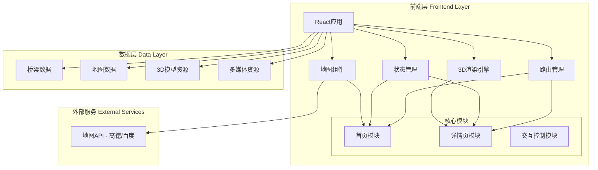
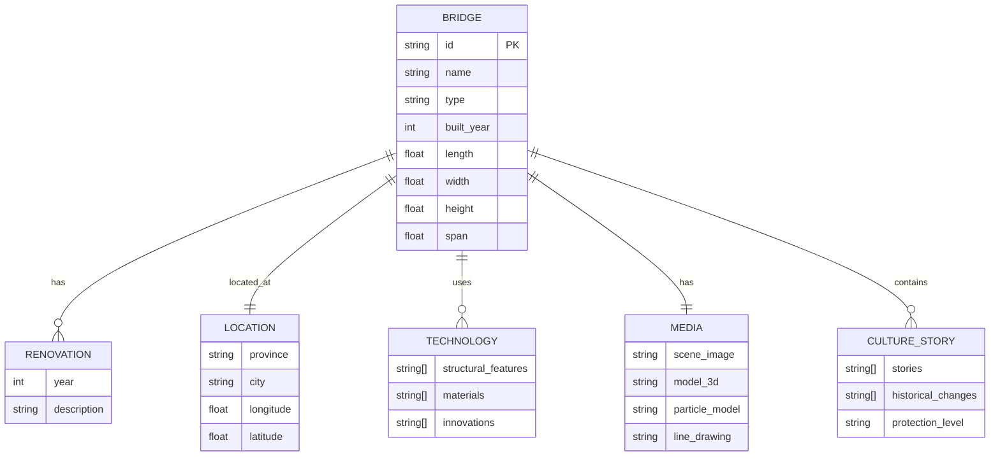

# 桥梁文化展示交互Web应用 - 技术架构文档

## 1. 架构设计



## 2. 技术说明

### 2.1 前端技术栈
- **框架**: React 18 + TypeScript
- **构建工具**: Vite 5.x
- **样式方案**: TailwindCSS 3.x
- **3D渲染**: Three.js + @react-three/fiber + @react-three/drei + @react-three/postprocessing
- **地图**: 高德地图/百度地图 API (或 Mapbox GL JS)
- **动画**: Framer Motion
- **状态管理**: Zustand (轻量级状态管理)
- **路由**: React Router v6

### 2.2 后端与数据库
- **后端**: 无后端,使用静态数据
- **数据存储**: JSON文件存储桥梁信息
- **资源托管**: 3D模型、图片等资源存放在 `public/assets/` 目录

### 2.3 开发工具
- **包管理器**: npm / pnpm
- **代码规范**: ESLint + Prettier
- **类型检查**: TypeScript strict mode

## 3. 路由定义

| 路由 | 用途 | 组件 |
|------|------|------|
| `/` | 首页,地图检索页面 | HomePage |
| `/bridge/:id` | 桥梁详情页面 | BridgeDetailPage |

## 4. API定义

由于本项目采用静态数据,无需后端API。数据通过以下方式获取:

### 4.1 桥梁数据接口 (TypeScript类型定义)

```typescript
// 桥梁基本信息
interface Bridge {
  id: string;
  name: string;
  alias?: string;
  location: {
    province: string;
    city: string;
    coordinates: [number, number]; // [经度, 纬度]
  };
  type: 'arch' | 'beam' | 'suspension' | 'floating' | 'covered' | 'other';
  dimensions: {
    length: number;
    width: number;
    height: number;
    span: number;
  };
  builtYear: number;
  renovationYears?: number[];
  culture: {
    stories: string[];
    historicalChanges: string[];
    protectionLevel: string;
    tourismInfo?: string;
  };
  technology: {
    structuralFeatures: string[];
    materials: string[];
    innovations: string[];
  };
  media: {
    sceneImage: string;
    model3d: string;
    particleModel?: string;
    lineDrawing: string;
    historicalPhotos?: string[];
  };
}

// 视角类型
type ViewType = 'global' | 'detail' | 'east' | 'south';

// 展示状态
type DisplayState = 'scene' | 'particle' | '3d';
```

### 4.2 数据文件结构

```
public/
  data/
    bridges.json          # 桥梁数据列表
    categories.json       # 分类数据
    tech-timeline.json    # 技术发展时间轴
  assets/
    models/               # 3D模型文件 (.glb/.gltf)
    images/               # 图片资源
      scenes/             # 场景图
      line-drawings/      # 线图
      historical/         # 历史照片
```

## 5. 数据模型

### 5.1 实体关系图



### 5.2 数据示例

```json
{
  "id": "zhaozhou-bridge",
  "name": "赵州桥",
  "alias": "安济桥",
  "location": {
    "province": "河北省",
    "city": "赵县",
    "coordinates": [114.76, 37.70]
  },
  "type": "arch",
  "dimensions": {
    "length": 64.4,
    "width": 9.6,
    "height": 7.23,
    "span": 37.02
  },
  "builtYear": 605,
  "renovationYears": [1955, 1984],
  "culture": {
    "stories": [
      "鲁班造桥传说",
      "张果老倒骑驴的民间故事"
    ],
    "historicalChanges": [
      "隋代始建,距今已有1400多年历史",
      "1955年进行全面修缮"
    ],
    "protectionLevel": "全国重点文物保护单位",
    "tourismInfo": "国家AAAA级旅游景区"
  },
  "technology": {
    "structuralFeatures": [
      "敞肩拱结构",
      "单孔石拱桥",
      "28道拱圈并列砌筑"
    ],
    "materials": ["石灰岩", "铁榫"],
    "innovations": [
      "世界现存最早的敞肩石拱桥",
      "首创敞肩拱结构形式"
    ]
  },
  "media": {
    "sceneImage": "/assets/images/scenes/zhaozhou-bridge.jpg",
    "model3d": "/assets/models/zhaozhou-bridge.glb",
    "particleModel": "/assets/models/zhaozhou-bridge-particle.glb",
    "lineDrawing": "/assets/images/line-drawings/zhaozhou-bridge.svg",
    "historicalPhotos": [
      "/assets/images/historical/zhaozhou-1.jpg"
    ]
  }
}
```

## 6. 核心组件架构

### 6.1 首页组件树

```
HomePage
├── Header (品牌区)
│   ├── BrandLogo
│   └── DecorativePattern
├── MapContainer (地图检索区)
│   ├── MapComponent (高德/百度地图)
│   └── BridgeMarkers (桥梁标记图层)
│       └── BridgeMarker (单个标记)
│           └── HoverCard (悬停卡片)
├── BridgeList (桥梁列表)
│   ├── SearchBar (搜索栏)
│   └── BridgeListItem (列表项)
└── Toolbar (底部工具栏)
    ├── ViewSwitcher (视角切换)
    ├── CategoryFilter (分类筛选)
    └── TechTimeline (技术发展轴)
```

### 6.2 详情页组件树

```
BridgeDetailPage
├── DisplayArea (交互展示区)
│   ├── DisplayControls (三态切换按钮)
│   ├── SceneImage (场景图)
│   ├── ParticleModel (粒子模型)
│   │   └── ParticleCanvas (Three.js画布)
│   └── Model3D (3D模型)
│       └── ThreeScene (Three.js场景)
│           ├── BridgeModel
│           ├── Environment
│           └── Controls
├── InfoCard (桥梁信息卡)
│   ├── BasicInfo (基本信息)
│   ├── DimensionsDisplay (尺寸展示)
│   ├── Timeline (历史变迁)
│   ├── CultureStories (人文故事)
│   └── TechFeatures (关键技术)
└── BridgeList (桥梁列表,固定右侧)
```

## 7. 性能优化策略

### 7.1 3D模型优化
- 使用 Draco 压缩几何数据
- LOD (Level of Detail) 分级加载
- 纹理压缩和渐进式加载
- 视锥体剔除 (Frustum Culling)

### 7.2 资源加载
- 图片懒加载和预加载策略
- 模型按需加载 (路由级别代码分割)
- Service Worker 缓存静态资源
- 资源优先级管理

### 7.3 渲染优化
- React.memo 避免不必要重渲染
- 虚拟滚动处理长列表
- 防抖/节流处理高频交互
- Three.js 场景优化 (减少绘制调用)

## 8. 部署方案

### 8.1 构建输出
- 静态资源托管 (CDN)
- Gzip/Brotli 压缩
- 资源哈希命名,长期缓存

### 8.2 推荐平台
- Vercel / Netlify (自动化部署)
- 阿里云 OSS + CDN
- 腾讯云 COS + CDN

## 9. 开发阶段划分

### 阶段一:基础框架搭建
- React项目初始化
- 路由配置
- 全局样式和主题
- 基础组件库

### 阶段二:首页开发
- 地图组件集成
- 桥梁数据加载和渲染
- 悬停卡片交互
- 底部工具栏

### 阶段三:详情页开发
- 3D场景搭建
- 三态切换功能
- 信息展示组件
- 列表联动

### 阶段四:优化和打磨
- 动画效果完善
- 性能优化
- 细节调整
- 测试和修复